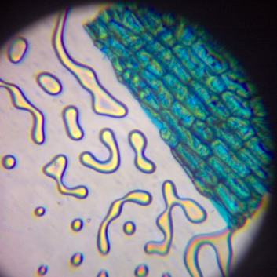

<center style = "font-size: 3em"><b>Project: 自制显微镜与系统优化</b></center>

**姓名**：<u>毕邹彬</u>&emsp;**学号**：<u>3180105490</u>&emsp;**专业**：<u>计算机科学与技术</u>

**姓名**：<u>陈希尧</u>&emsp;**学号**：<u>3180103012</u>&emsp;**专业**：<u>计算机科学与技术</u>

**姓名**：<u>肖瑞轩</u>&emsp;**学号**：<u>3180103127</u>&emsp;**专业**：<u>计算机科学与技术</u>

**时间**：<u>2020-11-15</u>

**指导老师**：<u>吴鸿智</u>

<center style = "font-size: 2em">目录</center>

[TOC]

## 一、简介

我们的计划是制作一款简易且高效的显微相机。

硬件方面，我们利用增加额外的透镜和机械调节装置来实现了显微镜的调节功能。

软件方面，我们利用神经网络等工具来弥补物理成像所产生的不足：

 * 模糊

   * 超分辨率

   * 去抖动
 * 色散
 * 晕影
 * 捕捉深度信息

最后，我们发现还有很多的不足，由此给出一些对于失败的总结。


## 二、硬件方面

### 2.1 搭建显微镜

我们重组了原有的相机框架，利用其将相机支撑起来。


底座部分则是使用了儿童显微镜的底座，这样就有了易于调节的光源。


从图中可以注意到，相机的支撑部分是由螺丝固定住的。这就导致调节相机的位置变得非常困难，因此我们并没有按照常见的显微镜结构来进行设计，而是将镜头和玻片都固定在镜头上，通过调节玻片距离镜头的位置来调节物距。

调节物距是利用下图这个类似斜劈的物件来实现的，它放置在镜头和玻片之间，通过调节其位置可以调节镜头和玻片间的距离，从而实现物距的调节。


新增的外部镜头的结构如下图所示，我们总共有3个放大倍数的镜头，分别是200倍、400倍和520倍。


上图中的镜头上银色的部分为磁铁，通过镜头上的磁铁和一个额外的磁铁可以夹住玻片，避免其与镜头之间发生相对位移，从而增强稳定性。

最后我们得到如下所示的显微镜：


### 2.2 拍摄效果

由于需要较大的数据集且Pylon Viewer官方所提供的相机控制程序并不稳定（经常出现绿屏，这里建议之后上课可以使用python的库来连接相机，稳定性很好），所以使用一个简单的python程序来拍摄数据集。

```python
import numpy as np
import matplotlib.pyplot as plt
import cv2
import glob
from pypylon import pylon

camera = pylon.InstantCamera(pylon.TlFactory.GetInstance().CreateFirstDevice())
camera.StartGrabbing(pylon.GrabStrategy_LatestImageOnly)
converter = pylon.ImageFormatConverter()
converter.OutputPixelFormat = pylon.PixelType_BGR8packed
converter.OutputBitAlignment = pylon.OutputBitAlignment_MsbAligned

scale_size = 5

i = 1
flag = False
while camera.IsGrabbing():

    grabResult = camera.RetrieveResult(5000, pylon.TimeoutHandling_ThrowException)

    if grabResult.GrabSucceeded():
        image = converter.Convert(grabResult)
        img = image.GetArray()
        cv2.namedWindow('title', cv2.WINDOW_NORMAL)
        cv2.imshow('title', img)
        k = cv2.waitKey(300)
        if k == 27:
            break
        if k == 13:
            flag = ~flag
        if flag:
            print("capturing...")
            a = img.shape[1] - img.shape[0]
            a = int(a / 2)
            a = a - 100
            cv2.imwrite("./pro_data1/" + str(i) + ".jpg", img[0:img.shape[0], a:a + img.shape[0]])
            i = i + 1
        else:
            print("waiting...")
    grabResult.Release()
camera.StopGrabbing()
cv2.destroyAllWindows()
```

初步获得的图像如下：


<center>左上：浆果毛；右上洋葱表皮；左下：菌类；右下：蚂蚁。</center>

在图像的拍摄过程中，我们发现了一些问题：

* 由于显微镜观察的是微观世界，一些难以感受到的震动也会影响相机的拍摄，造成图像的模糊；
* 图中有很严重的色散现象；
* 我们通过图片只能得到二维的信息，是否可能得到更多的三维的信息？


## 三、软件处理

### 3.1 超分辨率

首先我们考虑使用神经网络对图片的分辨率进行优化，但是对于图像优化这样的任务，普通的NN似乎都没有办法胜任，因为我们也没办法在短时间内建立出合适的模型然后一步步调参，所以我们选择了使用GAN。

GAN的基本算法流程如下：

1. 初始化generator和discriminator
2. 每一次迭代过程中：
   1. 固定generator， 只更新discriminator的参数。从你准备的数据集中随机选择一些，再从generator的output中选择一些，现在等于discriminator有两种input。接下来， discriminator的学习目标是, 如果输入是来自于真实数据集，则给高分；如果是generator产生的数据，则给低分，可以把它当做一个回归问题。
   2. 接下来，固定住discriminator的参数, 更新generator。将一个向量输入generator， 得到一个output， 将output扔进discriminator, 然后会得到一个分数，这一阶段discriminator的参数已经固定住了，generator需要调整自己的参数使得这个output的分数越大越好。


我们最终使用的模型是[SinGAN](https://github.com/tamarott/SinGAN)中的SR方法，SR方法仅仅是SinGAN中的方法通过preTrain好的模型去生成结果的一种应用，SinGAN的流水线如下：


这个模型包含了多层的GAN，在该金字塔中训练和推理都是从粗到细的方式完成。在每个尺度上，$G_n$都会学习生成图像样本，其中所有重叠的色块与下采样训练图像$x_n$中的色块区分开无法被鉴别器$D_n$区分开；有效的补丁尺寸随着我们训练的迭代而减小。$G_n$的输入是随机噪声图像$z_n$以及从前一个尺度$\widetilde{x}_n$生成的图像，向上采样至当前分辨率。第$n$级的生成过程涉及所有生成器$\{G_N ... G_n\}$和所有噪声图$\{z_N, ..., z_n\}$达到这个水平。

SinGAN 包含金字塔结构的生成器 $\left\{G_{0}, \ldots, G_{N}\right\},$ 训练图像金字塔 $x:\left\{x_{0}, \ldots, x_{N}\right\},$ 其中 $x_{n}$ 是图 像 $x$ 的下采样版本，采样因子为 $r^{n}, r>1$ 。每个生成器 $G_{n}$ 负责生成对应 $x_{n}$ 的真实图像样本。

图像样本的生成从最粗尺度开始，然后烦序地通过所有的生成器逐渐生成最好尺度图像，每个尺度都输入噪声图像。所有的生成器和判别器具有相同的感受野，随着生成过程的进行，可以捕捉更细尺寸的结构。在最粗尺度下，是纯生成过程，即 $G_{N}$ 将空间高斯白噪声 $z_{N}$ 映射为一个图像样本 $\tilde{x}_{N}$ 而不需要真实图像，如下：

$$
\tilde{x}_{N}=G_{N}\left(z_{N}\right)
$$

这一尺度的有效感受野通常是图像高度的 $1 / 2,$ 因此$G_{N}$可以生成图像的格体布局和目标的全局结构。更细尺度的每个生成器 $G_{n}(n<N)$ 为模型添加之前尺度下没有生成的细节，除了空间噪声之外，每个生成器 $G_{n}$ 还接收较粗尺度生成图像的上采样版本作为输入, 如下：

$$
\tilde{x}_{n}=G_{n}\left(z_{n},\left(\tilde{x}_{n+1}\right) \uparrow^{r}\right), n<N
$$

所有生成器具有相似的结构，具体而言，噪声 $z_{n}$ 加上图像 $\left(\tilde{x}_{n+1}\right) \uparrow^{r}$ 作为输入送给一系列卷积层。卷积层的作用是生成 $\left(\tilde{x}_{n+1}\right) \uparrow^{r}$ 中缺少的细节，$G_{n}$的操作如下：

$$
\tilde{x}_{n}=\left(\tilde{x}_{n+1}\right) \uparrow^{r}+\psi_{n}\left(z_{n}+\left(\tilde{x}_{n+1}\right) \uparrow^{r}\right)
$$

其中 $\psi_{n}$ 是一个由 $3 \times 3$ 卷积-BN-LeakyReLU 组成的 5 层全卷积网络。在最粗尺度使用 32 个卷积核（即卷积操作的输出通道数是32），然后每四个尺度增加两倍。因为生成器是全卷积的，所以在测试时可以以任意尺寸和纵横比生成图像（通过改变噪声图像的维度）。

使用这个模型进行训练最后我们得到的一个结果如下：

<table>
    <tr>
        <td><center></center></td>
        <td><center></center></td>
    </tr>
    <tr>
        <td><center>Blurred Pic</center></td>
        <td><center>Generated Pic</center></td>
    </tr>
</table>


可以看到效果实际上并不是很好，显微镜的观察区域并没有明显的分辨率提高，周围还有明显的过度锐化痕迹。可以猜测是因为本来的分辨率就低（进行SR实验时新买的透镜还没到货），所以训练的模型效果也不好，因此只能做到如此。

### 3.2 去抖动

因此我们更换了一个实验思路，实验时的成像效果不理想不全是由分辨率不足造成的，还有一个很重要的原因是显微镜的抖动。在显微镜这个层面下，再微小的抖动都会对实验结果有极大的影响。

因此我们想再通过神经网络来实现对于抖动的消除。考虑到抖动反映在图像上的本质就是运动模糊，因此我们考虑实现对于图片中运动模糊的消除。

#### 3.2.1 运动模糊的实现

运动模糊(motion blur)是指快速移动的物体造成的明显的模糊拖动痕迹，实际上也就相当于快速移动相机所造成的模糊拖动痕迹。参考

```python
def blur(image, degree=12, angle=random.randint(0, 179)):
    image = np.array(image)
    # 这里生成任意角度的运动模糊kernel的矩阵， degree越大，模糊程度越高
    M = cv2.getRotationMatrix2D((degree / 2, degree / 2), angle, 1)
    motion_blur_kernel = np.diag(np.ones(degree))
    motion_blur_kernel = cv2.warpAffine(motion_blur_kernel, M, (degree, degree))
    motion_blur_kernel = motion_blur_kernel / degree
    blurred = cv2.filter2D(image, -1, motion_blur_kernel)
    # convert to uint8
    cv2.normalize(blurred, blurred, 0, 255, cv2.NORM_MINMAX)
    blurred = np.array(blurred, dtype=np.uint8)
    return blurred
```

#### 3.2.2 利用GAN去运动模糊

在查阅了大量资料后，我们参考了论文[DeblurGAN: Blind Motion Deblurring Using Conditional Adversarial Networks](https://arxiv.org/pdf/1711.07064.pdf)以及其实现[KupynOrest/DeblurGAN: Image Deblurring using Generative Adversarial Networks](https://github.com/KupynOrest/DeblurGAN)来进行我们显微镜图片的去模糊处理


DeblurGAN它包含两个下采样卷积模块、9个残差模块(包含一个卷积、IN以及ReLU)以及两个上采样转置卷积模块，同时还引入全局残差连接。因此，该架构可以描述为：$I_S=I_B+I_R$。这种架构可以使得训练更快，同时具有更好的泛化性能。

 除了上述生成器外，在训练过程中，还定义了一个判别器(该判别器架构类似于PatchGAN)，采用带梯度惩罚项的Wasserstein GAN进行对抗训练。

由于选则了GAN以及内容进行训练，因而它的损失函数包含两个部分，定义如下：

$$
L=\underbrace{\underbrace{L_{G A N}}_{} \text {adv loss}+\underbrace{\lambda \cdot L_{X}}\text {content loss}} _{\text {total loss}}
$$

在实验中，$\lambda=100$。作者并未将判别损失纳入到上述损失中，这是因为我们无需对输入与输出 的不匹配进行惩罚处理。

关于对抗损失，作者在论文中提到，WGAN-GP 对于生成器更为鲁棒(作者尝试了多种架构证实了这 点发现)。对抗损失定义为：

$$
L_{G A N}=\sum_{n=1}^{N}-D_{\theta_{D}}\left(G_{\theta_{G}}\left(I^{B}\right)\right)
$$

关于内容损失，有两种可供选择：像素级的L1与L2损失。但是这两种损失函数均会导致最终生成 的模型结果比较平滑或存在伪影。因而，作者选择了感知损失，特征空间的L2损失。定义如下：

$$
L_{X}=\frac{1}{W_{i, j} H_{i, j}} \sum_{x=1} \sum_{y=1}\left(\phi_{i, j}\left(I^{S}\right) x, y-\phi i, j\left(G_{\theta_{G}}\left(I^{B}\right)\right)_{x, y}\right)^{2}
$$


在此基础上，我们拍摄了五百余张图片，将其中的500张作为训练集，将剩下的45张作为测试集（由于算力资源有限，并没有采用KFold的方法来提升模型的精确度）进行了实验，得到了如下的效果展示：

以下三列分别是使用模糊函数处理过的图片、使用训练好的模型生成的去模糊图片、原图。

<table>
    <tr>
        <td><center></center></td>
        <td><center></center></td>
        <td><center></center></td>
    </tr>
    <tr>
        <td><center></center></td>
        <td><center></center></td>
        <td><center></center></td>
    </tr>
    <tr>
        <td><center></center></td>
        <td><center></center></td>
        <td><center></center></td>
    </tr>
    <tr>
        <td><center>Blurred Pic</center></td>
        <td><center>Generated Pic</center></td>
        <td><center>Ground Truth</center></td>
    </tr>
</table>

可见去除运动模糊的效果还是较为显著的

#### 3.2.3 其他去抖动的方式尝试

在实验初期，我们了解到 ，因此我们也尝试了使用模仿Photoshop中的防抖动滤镜的实现方式，使用了锐化边缘的方式进行防抖动处理，添加了简单的锐化滤镜，但最终的效果相比GAN网络实现的效果差很多。

<div><center></center></div>


### 3.3 色散

在初始采样的照片样本中，我们发现由于显微镜的光学结构原因，成像的圆孔边缘有时候会出现较为明显的色散现象。我们参考了Kromo的处理方式，将添加色度的add chromatic过程，逆向化，检测边缘的颜色通道的色散特征（红、蓝通道），色散效果逆向消除，从而实现简单的软件除色散。

add chromatic正向过程

```python
def add_chromatic(im, strength: float = 1, no_blur: bool = False):
 
    r, g, b = im.split()
    rdata = np.asarray(r)
    gdata = np.asarray(g)
    bdata = np.asarray(b)
    if no_blur:
        # channels remain unchanged
        rfinal = r
        gfinal = g
        bfinal = b
    else:
        poles = cartesian_to_polar(np.stack([rdata, gdata, bdata], axis=-1))
        rpolar, gpolar, bpolar = poles[:, :, 0], poles[:, :, 1], poles[:, :, 2],

        bluramount = (im.size[0] + im.size[1] - 2) / 100 * strength
        if round(bluramount) > 0:
            rpolar = vertical_gaussian(rpolar, round(bluramount))
            gpolar = vertical_gaussian(gpolar, round(bluramount * 1.2))
            bpolar = vertical_gaussian(bpolar, round(bluramount * 1.4))

        rgbpolar = np.stack([rpolar, gpolar, bpolar], axis=-1)
        cartes = polar_to_cartesian(rgbpolar, width=rdata.shape[1], height=rdata.shape[0])
        rcartes, gcartes, bcartes = cartes[:, :, 0], cartes[:, :, 1], cartes[:, :, 2],

        rfinal = Image.fromarray(np.uint8(rcartes), 'L')
        gfinal = Image.fromarray(np.uint8(gcartes), 'L')
        bfinal = Image.fromarray(np.uint8(bcartes), 'L')

    gfinal = gfinal.resize((round((1 + 0.018 * strength) * rdata.shape[1]),
                            round((1 + 0.018 * strength) * rdata.shape[0])), Image.ANTIALIAS)
    bfinal = bfinal.resize((round((1 + 0.044 * strength) * rdata.shape[1]),
                            round((1 + 0.044 * strength) * rdata.shape[0])), Image.ANTIALIAS)

    rwidth, rheight = rfinal.size
    gwidth, gheight = gfinal.size
    bwidth, bheight = bfinal.size
    rhdiff = (bheight - rheight) // 2
    rwdiff = (bwidth - rwidth) // 2
    ghdiff = (bheight - gheight) // 2
    gwdiff = (bwidth - gwidth) // 2

    im = Image.merge("RGB", (
        rfinal.crop((-rwdiff, -rhdiff, bwidth - rwdiff, bheight - rhdiff)),
        gfinal.crop((-gwdiff, -ghdiff, bwidth - gwdiff, bheight - ghdiff)),
        bfinal))


    return im.crop((rwdiff, rhdiff, rwidth + rwdiff, rheight + rhdiff))

```

示例中给出的效果

<div><center></center></div>

实际使用在样本后的测试效果

<div><center></center></div>

<div><center></center></div>

<div><center></center></div>


​	可以看到，对于圆孔边缘处出现的偏蓝色与偏绿色的色散，相比于左边的原图，右图中这样的色散检测与抵消模型可以有效的抵消掉部分的色散。取得这样的效果后，我们试图模仿去掉运动模糊的形式搭建GAN的神经网络对色散进行学习与消除，但最后并未取得较好的效果。

### 3.4 晕影

​	在观察初始样本之后，我们发现由于显微镜光孔在视野中心，因此在相机中观测到的样本周围的圆圈部分会出现比较昏暗模糊的部分，因此我们需要尝试对这些晕影的部分进行消除。我们参考去阴影的方式进行暗角查找，从而去掉周围昏暗晕影，图像校正的过程大致如下：

```c++
int Devignetting_Original(unsigned char *Src, unsigned char *Dest, int Width, int Height)
{
    if ((Src == NULL) || (Dest == NULL))        return STATUS_NULLREFRENCE;
    if ((Width <= 0) || (Height <= 0))            return STATUS_INVALIDPARAMETER;
    const float Step = 0.2f;      
    float SmallestEntropy = 1000000000000.0f;
    float A = 0, B = 0, C = 0;            
    int CenterX = Width / 2, CenterY = Height / 2;        
    for (int X = -10; X <= 10; X++)       
    {
        for (int Y = -10; Y <= 10; Y++)
        {
            for (int Z = -10; Z <= 10; Z++)
            {
                if (IsValidABC_Original(X * Step, Y * Step, Z * Step) == true)    
                {
                    float Entropy = CalculateEntropyFromImage(Src, Width, Height, X * Step, Y * Step, Z * Step, CenterX, CenterY);
                    if (Entropy < SmallestEntropy)                                    //   
                    {
                        A = X * Step;
                        B = Y * Step;
                        C = Z * Step;
                        SmallestEntropy = Entropy;
                    }
                }
            }
        }
    }
    float Invert = 1.0 / (CenterX * CenterX + CenterY * CenterY + 1);
    for (int Y = 0; Y < Height; Y++)
    {
        byte *LinePS = Src + Y * Width * 4;
        byte *LinePD = Dest + Y * Width * 4;
        int SquareY = (Y - CenterY) * (Y - CenterY);
        for (int X = 0; X < Width; X++)
        {
            int RadiusSqua2 = (X - CenterX) * (X - CenterX) + SquareY;
            float R2 = RadiusSqua2 * Invert;                                   
            float Gain = 1 + (R2 * (A + R2 * (B + R2 * C)));                  
            LinePD[0] = ClampToByte(LinePS[0] * Gain);            
            LinePD[1] = ClampToByte(LinePS[1] * Gain);
            LinePD[2] = ClampToByte(LinePS[2] * Gain);
            LinePD += 4;
            LinePS += 4;
        }
    }
    return STATUS_OK;
}
```

最终实现的效果如下右图所示。可以看到，相比于左边的原图，部分边缘的模糊昏暗的晕影无效部分成功被去掉了。

<div><center></center></div>

### 3.5 捕捉深度信息

在实验的初期，我们也尝试了通过移动载玻片微小的距离，通过测量移动的微小距离与相机的参数来进行简单而粗糙的深度图重建，但在实验的过程中由于放大的倍数难以实际测量，并且难以保证移动的方向完全沿载玻片方向，导致深度重建的精度难以保证，最终生成的深度图效果并不好，如下图所示：


​	生成的简单的3D模型效果如下图：


我们并未得到有意义的深度信息。


## 四、思考与总结

### 4.1 思考与改进

#### 4.1.1神经网络的进一步调参与数据的可视化

在实验的过程中，我们发现通过调节`blur`模糊函数的参数，训练网络中归一化时的参数等，都能够明显地改变最后的实验结果，因此在未来我们可以进一步调整神经网络中的输入参数，达到更好的效果。在结果的展示中，对于模型中的可视化也可以在未来做出更具体的效果。

#### 4.1.2 色散的物理优化

除了软件对色散的优化方式之外，我们还可以通过添加物理装置的方式进行优化。色散是复色光分解为单色光而形成光谱的现象。复色光进入棱镜后，由于它对各种频率的光具有不同折射率，各种色光的传播方向有程度的偏折，因而在离开棱镜时就各自分散，形成光谱。


不同材料会引起复色光不同程度的色散，我们可以利用这一点来减弱色散现象。


前面我们使用添加色度的逆过程的方法会丢失相当多的信息，相比之下，这种方法能较大程度的包留图像原本的信息。如果能够通过这种方法采集到低色散情况下的图片，我们认为也许可以利用神经网络获得较好的去色散效果。但是由于并未在市面上找到适合本此实验的去色散镜片，所以我们并未能够对其进行实验检测。

#### 4.1.3 另一种超分辨率的训练方式（低倍学习高倍）

本此实验中，虽然我们购买了多个放大倍数的显微镜镜头，但是对其的利用程度还有进一步的提升空间。这主要是受到了我们硬件部分设计的限制：镜头和玻片在同一个装置中，于是无法保证在不移动玻片且移动前后能够拍摄同一位置的前提下更换显微镜镜头。

若是能将其分开，并实现理想状态下显微镜头的切换，我们将可以同时拍摄一组高倍镜头下的数据集和一组低倍镜头下的数据集，利用更真实的数据从低倍数据集向高倍数据集学习，生成从低倍物镜到高倍物镜的训练模型，尝试通过这一种方式提高分辨率。

### 4.2 总结

在本次Project中，我们进行了围绕提高显微镜成像质量的探索与尝试。

由于显微镜是一个我们平时不大会接触到的仪器，所以在实验开始时我们对于可以进行的实验方向较为迷茫。这是一门以实验为基础的课程，我们想也许我们可以从实验下手，先尝试获取图像，然后再根据其中发现的问题来确定我们最终的实验方向。自然，我们发现了相当数量的问题：模糊、色散、晕影以及抖动等等。我们自然不可能解决所有问题，但我们也不能一开始就知道我们能解决什么问题，还是一样的方法——从实验下手。我们尝试了一些常见的解决方法，也利用了一些当下热门的方法，如神经网络等。最终，我们在利用GAN处理抖动模糊时获得了相对不错的效果。其实通过这门课程，我们不仅仅在学习如何去更好地获取图像、处理图像，我们更多地学到了一种全新的教学模式——实践。

最后，以《晏子春秋》中的一句话作为我们的总结和对之后学习工作的激励：

<center>“为者常成，行者常至。”<center>

## 五、附录

### Reference

[Saurabh23/mSRGAN-A-GAN-for-single-image-super-resolution-on-high-content-screening-microscopy-images.: Generative Adversarial Network for single image super-resolution in high content screening microscopy images](https://github.com/Saurabh23/mSRGAN-A-GAN-for-single-image-super-resolution-on-high-content-screening-microscopy-images.)

[tamarott/SinGAN: Official pytorch implementation of the paper: "SinGAN: Learning a Generative Model from a Single Natural Image"](https://github.com/tamarott/SinGAN)

[SinGAN: Learning a Generative Model from a Single Natural Image](https://arxiv.org/pdf/1905.01164.pdf)

[KupynOrest/DeblurGAN: Image Deblurring using Generative Adversarial Networks](https://github.com/KupynOrest/DeblurGAN)

[DeblurGAN: Blind Motion Deblurring Using Conditional Adversarial Networks](https://arxiv.org/pdf/1711.07064.pdf)

更多论文的参考见附件。