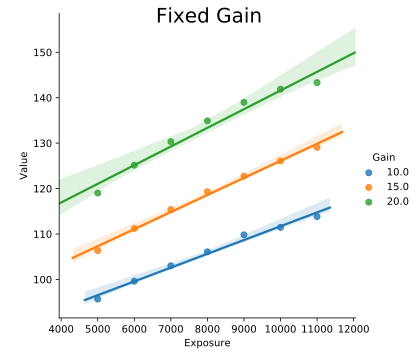
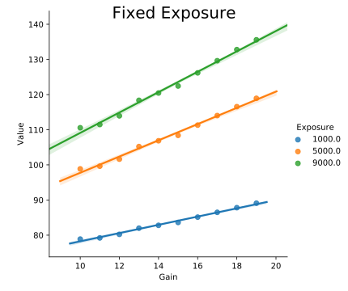
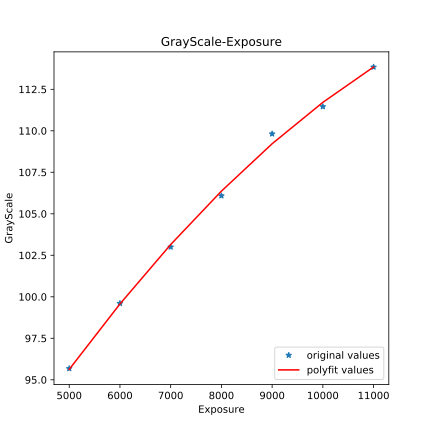
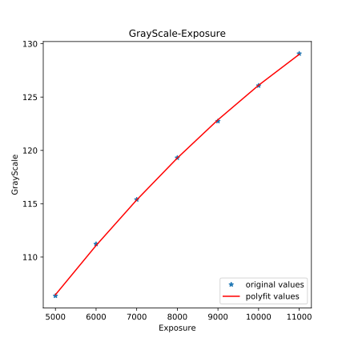
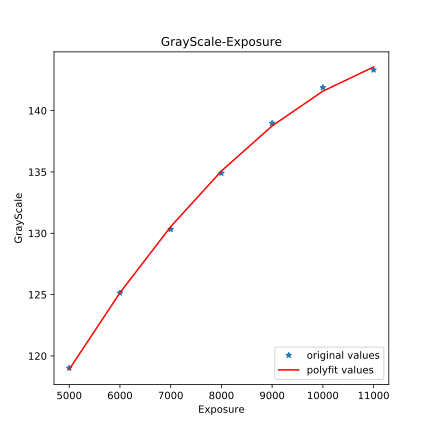
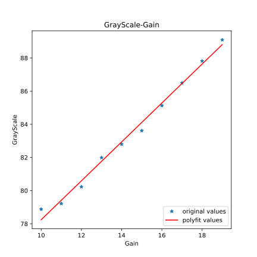
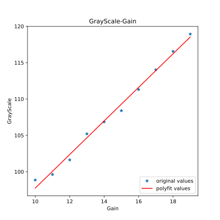
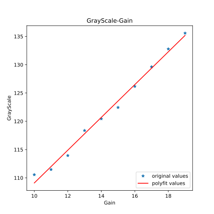

<center style = "font-size: 4em">智能视觉信息采集实验报告</center><br/><br/><br/><br/>

**姓名**：<u></u>&emsp;**学号**：<u></u>&emsp;**专业**：<u>计算机科学与技术</u>

**姓名**：<u>陈希尧</u>&emsp;**学号**：<u>3180103012</u>&emsp;**专业**：<u>计算机科学与技术</u>

**姓名**：<u></u>&emsp;**学号**：<u></u>&emsp;**专业**：<u>计算机科学与技术</u>

**实验时间**：<u>2020-9-18</u>

**指导老师**：<u>吴鸿智</u>

<center style = "font-size: 2em">Table of Contents</center>


[TOC]

# Purpose

1. Study the relationship between camera parameters and captured images(pixels) via experiments:
    1. Exposure
    2. Gain
2. [Bonus 25%] Derive a quantitative noise model for captured pixels
    1. What are related parameters?
    2. What is the equation of the noise? How well it explains captured pixels?

# Environment

1. Pylon Viewer for GUI
2. Visual Studio with opencv2 and pylon sdk to acquire data
3. Seaborn and matplotlib to visualization data, numpy and scipy to do calculation

# Gain & Exposure

## Steps

1. Use Pylon to capture photos
2. Use Visual Studio to set parameter and do test in large quantities
3. Use Python to analysis the data and visualize the result

## Results

With Fixed Gain in [10, 15, 10], Exposure ranges from 5000 to 11000, the result of grayscale is:



With Fixed Exposure Time in [1000, 5000, 9000], Gain ranges from 10 to 19, the result of grayscale is:



Also we calculate the r^2^ of each parameter and the grayscale with another parameter fixed and get the result as follows:

| Fixed Exposure |   r^2^   | Fixed Gain |   r^2^   |
| :------------: | :------: | :--------: | :------: |
|      1000      | 0.990992 |     10     | 0.987483 |
|      5000      | 0.992227 |     15     | 0.993612 |
|      9000      | 0.991989 |     20     | 0.968081 |

Apparently the second graph indicates that the relation between Gain and Grayscale is linear, but the other seems to be Quadratic, so we try fit them each with different method and get the follwing results:

<center></center><br /><center>Fixed Gain = [10, 15, 20]</center><br /><center></center><br /><center>Fixed ExposureTime = [1000, 5000, 9000]</center>

Where the Regression is as follows:

| Fixed Gain | Grayscale($x$ denotes Exposure Time)           | Fixed Exposure Time | Grayscale($x$ denotes Gain) |
| ---------- | ---------------------------------------------- | ------------------- | --------------------------- |
| Gain=10    | $-1.809\times10^{-7} x^2 + 0.00593 x + 70.5$   | Exposure=1000       | $1.174 x + 66.5$            |
| Gain=15    | $-1.721\times10^{-7} x^2 + 0.006511 x + 78.21$ | Exposure=5000       | $2.309 x + 74.66$           |
| Gain=20    | $-4.268\times10^{-7} x^2 + 0.01094 x + 74.89$  | Exposure=9000       | $2.899 x + 80.11$           |


# Noise

## Steps

## Results

# Thoughts

本次实验遇到的问题主要是在SDK的使用方面的，例如在cpp中调用pylon 的API时，找不到Node的名字，最后在助教的帮助下发现了Pylon Viewer的参数下方的manual中就有Node的名字和API的说明。

# Appendix

## GetData.cpp

```cpp

```

## Analysis.py

```py
import numpy as np
import pandas as pd
import matplotlib.pyplot as plt
import seaborn as sns
import math


def Getr2(X, Y):
    xBar = np.mean(X)
    yBar = np.mean(Y)
    SSR = 0
    varX = 0
    varY = 0
    for i in X.index:
        diffX = X[i] - xBar
        diffY = Y[i] - yBar
        SSR += (diffX * diffY)
        varX += diffX**2
        varY += diffY**2
    SST = math.sqrt(varX * varY)
    return (SSR / SST)**2


data_fixedE = pd.DataFrame(columns=['Gain', 'Exposure', 'Value'])
data_fixedG = pd.DataFrame(columns=['Gain', 'Exposure', 'Value'])

for line in open('./data/data_fixedE.txt', 'r'):
    if line == '' or line == '\n':
        break
    else:
        a, b, c = map(float, line.split())
    data_fixedE = data_fixedE.append(
        {'Gain': a, 'Exposure': b, 'Value': c}, ignore_index=True)

for line in open('./data/data_fixedG.txt', 'r'):
    if line == '' or line == '\n':
        break
    else:
        a, b, c = map(float, line.split())
    data_fixedG = data_fixedG.append(
        {'Gain': a, 'Exposure': b, 'Value': c}, ignore_index=True)


print(data_fixedE.groupby('Exposure', as_index=False).apply(lambda data: pd.Series(
    {'r^2^': Getr2(data['Gain'], data['Value'])})).to_markdown(index=False))
print()
print(data_fixedG.groupby('Gain', as_index=False).apply(lambda data: pd.Series(
    {'r^2^': Getr2(data['Exposure'], data['Value'])})).to_markdown(index=False))

for G in data_fixedG['Gain'].unique():
    x = np.array(data_fixedG.query('Gain=='+str(G))['Exposure'])
    y = np.array(data_fixedG.query('Gain=='+str(G))['Value'])
    z1 = np.polyfit(x, y, 2)
    p1 = np.poly1d(z1)
    print('Gain = ', G, ':\n', p1, sep='')
    plt.figure(figsize=(6, 6))
    yvals = p1(x)
    plot1 = plt.plot(x, y, '*', label='original values')
    plot2 = plt.plot(x, yvals, 'r', label='polyfit values')
    plt.xlabel('Exposure')
    plt.ylabel('GrayScale')
    plt.legend(loc=4)
    plt.title('GrayScale-Exposure')
    # plt.show()
    plt.savefig('./assets/Poly_Gain_'+str(int(G))+'.svg')

for G in data_fixedE['Exposure'].unique():
    x = np.array(data_fixedE.query('Exposure=='+str(G))['Gain'])
    y = np.array(data_fixedE.query('Exposure=='+str(G))['Value'])
    z1 = np.polyfit(x, y, 1)
    p1 = np.poly1d(z1)
    plt.figure(figsize=(6, 6))
    print('Exposure = ', G, ':\n', p1, sep='')
    yvals = p1(x)
    plot1 = plt.plot(x, y, '*', label='original values')
    plot2 = plt.plot(x, yvals, 'r', label='polyfit values')
    plt.xlabel('Gain')
    plt.ylabel('GrayScale')
    plt.legend(loc=4)
    plt.title('GrayScale-Gain')
    # plt.show()
    plt.savefig('./assets/Poly_Exposure_'+str(int(G))+'.svg')

plt.figure(figsize=(6, 6))
fixed_Exposeure = sns.lmplot(
    data=data_fixedE,
    x='Gain', y='Value', hue='Exposure'
).fig.suptitle('Fixed Exposure', size=20)
plt.savefig('./assets/Linear_Exposure.svg')
# plt.show()

plt.figure(figsize=(6, 6))
fixed_Gain = sns.lmplot(
    data=data_fixedG,
    x='Exposure', y='Value', hue='Gain'
).fig.suptitle('Fixed Gain', size=20)
plt.savefig('./assets/Linear_Gain.svg')
# plt.show()
```

